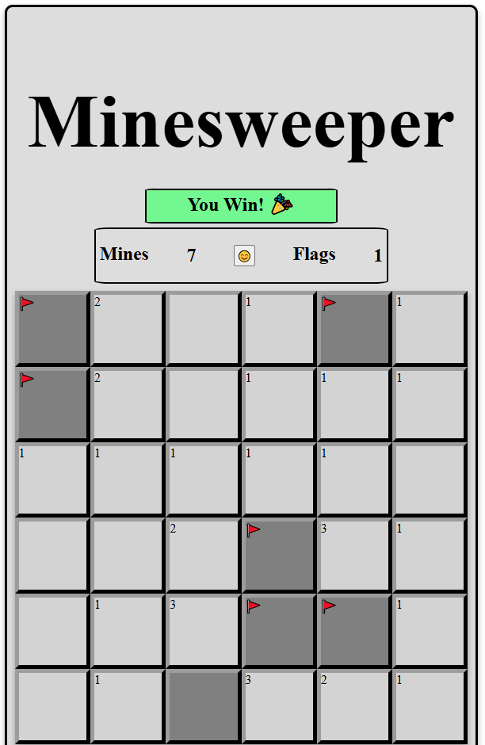
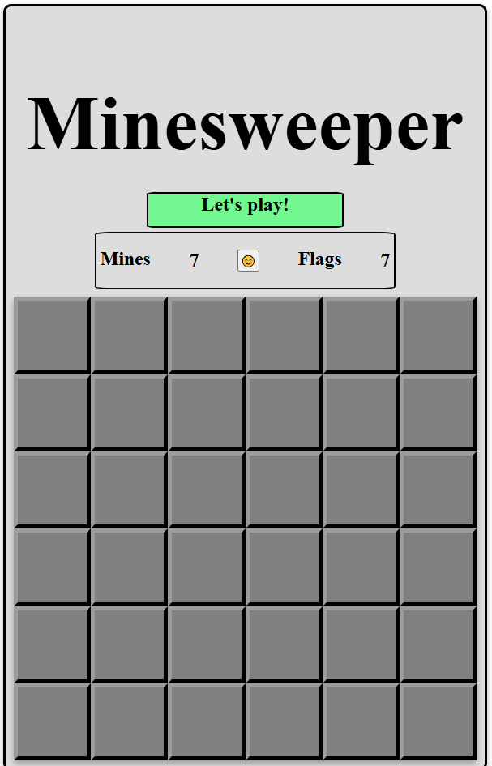
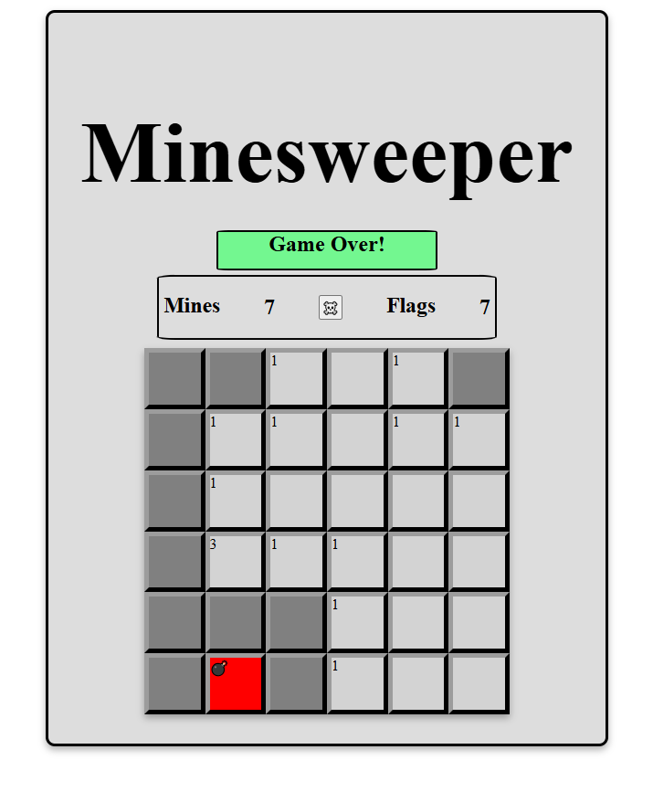

# Minesweeper
#### Description:
Minesweeper: Enhanced Edition is a modern twist on the classic logic-based puzzle game. Players uncover tiles on a hidden grid, using numerical clues to locate and avoid hidden mines. This version features all the standard mechanics—such as tile revealing, flagging suspected mines, and numerical hints—but also includes an automatic flood-reveal system. When an empty tile (with no adjacent mines) is uncovered, it triggers a chain reaction, revealing all nearby safe spaces, making gameplay smoother and more dynamic.

#### Background Info:
Originally developed by Microsoft in the early 1990s, Minesweeper became a staple of casual PC gaming. The game challenges logical reasoning and spatial awareness, rewarding players for deduction over guesswork. This enhanced version respects the classic formula while streamlining play through added quality-of-life features like auto-flooding and intuitive flag placement. It's a perfect blend of nostalgia and smart design improvements.

# Screenshot

# Technologies Used

- JavaScript
- HTML
- CSS

# Getting Started

<!-- [Click to View Project Planning](your Trello url here) -->
[Click to Play Minesweeper!](https://johnniebarron.github.io/Minesweeper/)

# Next Steps
#### upcoming Features
- Timer
- multiple difficulties
- Score tracking
- Win/Loss ratios 
- Leaderboards